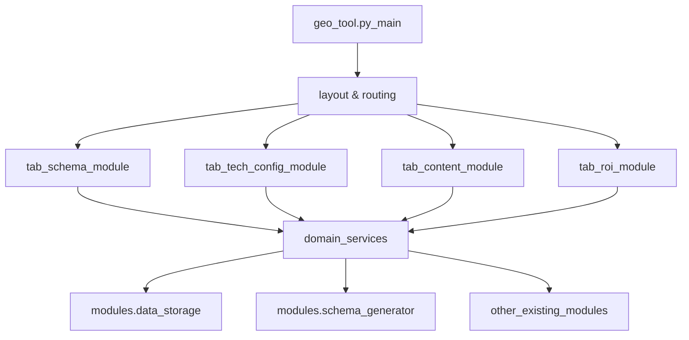

## 目标

- **核心目标**: 保持现有产品功能与 UI 行为基本不变的前提下，将臃肿的 `geo_tool.py` 拆分为清晰的多模块结构，降低单文件复杂度，方便后续开发与调试。
- **次要目标**: 建立可复用的 UI 组件与工具函数库，为后续功能拓展预留架构空间。

## 当前情况快速判断

- `geo_tool.py` 是 **Streamlit 单入口文件**，负责：
  - 全局样式（CSS 注入）、页面配置、会话状态管理。
  - 多个 Tab/功能区的 UI 与业务逻辑（Schema 生成、技术配置、内容优化、ROI 分析等）。
  - 大量直接使用的 `modules/*` 业务类（如 `SchemaGenerator`, `TechnicalConfigGenerator`, `MultimodalPromptGenerator` 等）。
- 文件超过 7800 行，已经严重影响：
  - 阅读理解成本（很难快速定位某个 Tab 的逻辑）。
  - 测试与重构（任意修改都有牵一发动全身的风险）。

## 拆分总体思路

- **保持入口不变**: 继续以 `[geo_tool.py](geo_tool.py)` 作为 Streamlit 启动入口（`streamlit run geo_tool.py` 不变）。
- **按 Tab/大功能模块拆分**: 每个 Tab/大功能区域抽象为独立的“页面模块”函数，放到 `modules/ui/` 目录下，由 `geo_tool.py` 统一路由与调用。
- **抽取公共基础层**:
  - UI 级别：常见的卡片布局、标题区域、Metric 区、表格封装等。
  - 逻辑级别：表单输入校验、异常展示、下载按钮封装、会话状态初始化等。
- **不改变底层业务类接口**: 继续使用现有的 `modules/*.py`（如 `SchemaGenerator` 等），优先只改调用位置与组织形式。

用一个简单架构图表示目标结构：

## 具体实施步骤

### 第 1 阶段：识别与规划 Tab 结构（只读分析）

- **任务**:
  - 在 `[geo_tool.py](geo_tool.py)` 中定位所有 `st.tabs([...])` / 顶层功能区块（如“Schema 生成”、“技术配置”、“内容评分”等）。
  - 为每个 Tab/功能区命名一个清晰的模块名（例如 `tab_schema`, `tab_tech_config`, `tab_multimodal`, `tab_roi`）。
- **产出**:
  - 一份 Tab → 模块名的映射清单（可写入 `docs/analysis/TABS_TO_MODULES.md`）。

### 第 2 阶段：抽取 Tab 级模块骨架

- **任务**:
  - 在 `modules/ui/`（如不存在则创建）下，为每个 Tab 新建一个文件，例如：
    - `[modules/ui/tab_schema.py](modules/ui/tab_schema.py)`
    - `[modules/ui/tab_tech_config.py](modules/ui/tab_tech_config.py)`
    - `[modules/ui/tab_multimodal.py](modules/ui/tab_multimodal.py)`
    - `[modules/ui/tab_roi.py](modules/ui/tab_roi.py)`
  - 每个文件提供一个统一签名的入口函数，例如：
    - `def render_tab_schema(state: st.session_state) -> None:`
  - 在 `[geo_tool.py](geo_tool.py)` 中：
    - 保留顶部导入和页面整体布局（标题、侧边栏等）。
    - 将各个 Tab 内部原有代码整体“剪切”到对应模块的 `render_*` 函数中。
    - Tab 切换处仅保留类似逻辑：
      - `if selected_tab == "Schema 工具": tab_schema.render_tab_schema(st.session_state)`。
- **注意点**:
  - 暂时避免重命名变量；尽可能原样移动，少量调整缩进与局部变量作用域以保证运行。

### 第 3 阶段：抽取通用 UI 组件与工具函数

- **任务**:
  - 分析不同 Tab 中重复使用的 UI 片段，例如：
    - 标题区 + 说明文字 + 表单布局。
    - 结果展示 + 下载按钮 + 使用说明。
  - 在 `modules/ui/components.py` 中创建可复用组件，例如：
    - `def render_section_header(title: str, subtitle: str) -> None`。
    - `def render_download_block(label: str, content: str, filename: str, mime: str, key: str) -> None`。
  - 在各个 `tab_*.py` 中用这些组件替换重复的代码片段。
- **收益**:
  - 减少重复代码，使 `tab_*.py` 更聚焦于业务逻辑。

### 第 4 阶段：整理业务服务层（可选但推荐）

- **任务**:
  - 对 `modules/*.py` 中的业务类/函数按领域拆分轻量“服务层”，例如在 `modules/services/` 下：
    - `schema_service.py`：封装 `SchemaGenerator` 的常用工作流（输入参数 → JSON-LD/HTML 输出）。
    - `tech_config_service.py`：封装 `TechnicalConfigGenerator` 的组合逻辑。
    - `multimodal_service.py`：封装 `MultimodalPromptGenerator` 的常见调用路径。
  - 在 `tab_*.py` 中只调用“服务函数”，不直接操作底层复杂对象。
- **收益**:
  - Tab 代码更偏向“用例/流程”，服务层集中处理细节，方便后续替换模型或 API。

### 第 5 阶段：会话状态与常量集中管理

- **任务**:
  - 在 `modules/ui/state.py` 中：
    - 定义统一的 `init_session_state()`，负责初始化所有在不同 Tab 使用的 `st.session_state` key。 
    - 定义相关的 key 名常量，避免魔法字符串散落在各个模块。
  - 在 `geo_tool.py` 的入口处调用 `init_session_state()`。
- **收益**:
  - 避免 session_state key 拼写错误导致的运行时 bug。
  - 未来扩展/重构 session 结构更简单。

### 第 6 阶段：CSS 与布局抽象

- **任务**:
  - 将 `geo_tool.py` 顶部大段 CSS 抽出到单独模块（例如 `[modules/ui/theme.py](modules/ui/theme.py)`）：
    - 暴露 `inject_global_theme()` 函数，内含 `st.markdown("""""", unsafe_allow_html=True)`。
  - 入口文件 `geo_tool.py` 在最开始调用 `inject_global_theme()`，保持 UI 现状。
- **收益**:
  - 清爽入口文件，CSS 调整有单一来源。

### 第 7 阶段：清理与文档更新

- **任务**:
  - 删除 `geo_tool.py` 中已迁移的死代码/注释块。
  - 在 `[DOCS.md](DOCS.md)` 或现有 `docs/analysis/*.md` 中补充：
    - 新的文件结构说明（入口 → Tab → 服务层 → 业务模块）。
    - 如何新增一个新 Tab：
      - 创建 `modules/ui/tab_newfeature.py`，实现 `render_tab_newfeature()`。
      - 在 `geo_tool.py` 中注册 Tab，并调用该函数。

## Todo 列表（后续实施用）

- **identify-tabs**: 在 `geo_tool.py` 中梳理所有 Tab/功能分区，并形成 Tab → 模块名映射清单。
- **extract-tab-modules**: 在 `modules/ui/` 下为每个 Tab 创建 `tab_*.py`，并从 `geo_tool.py` 中迁移对应 UI 与逻辑。
- **create-ui-components**: 在 `modules/ui/components.py` 中抽取通用 UI 组件，并在各个 `tab_*.py` 中替换重复片段。
- **setup-services-layer**: 在 `modules/services/` 下封装对现有业务模块的常见调用路径。
- **centralize-state**: 在 `modules/ui/state.py` 中集中管理 `st.session_state` 初始化与常量。
- **extract-theme**: 在 `modules/ui/theme.py` 中集中管理 CSS/主题注入，并在入口调用。
- **update-docs**: 更新 `DOCS.md` 或相关文档，说明新结构和新增功能的规范流程。

